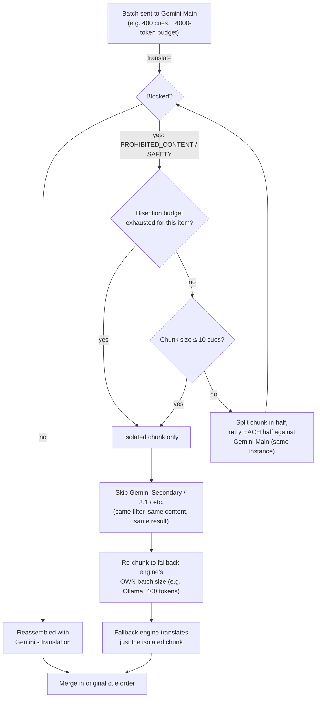

# Subtitlarr

Fills gaps in your Bazarr subtitle library by translating subtitles you already
have (e.g. English) into languages you're missing (e.g. Spanish), using a
local or cloud LLM. Runs as its own container — it never mounts your media
folders. All reading and writing of subtitles happens through Bazarr's own
REST API, so Bazarr remains the only thing with filesystem access to your
library.

**Full documentation, setup guides, and other helpers:
[gerardumbert.github.io/Subtitlarr](https://gerardumbert.github.io/Subtitlarr)**

## How it works

1. Polls Bazarr's wanted-subtitle list on a schedule.
2. For each wanted item, checks (via Bazarr's API) whether a subtitle already
   exists in one of your preferred source languages.
3. If so, reads that subtitle's content (via Bazarr's API), translates the
   dialogue with your configured engine cascade, and reassembles it onto the
   *original* timing — the LLM never touches timestamps.
4. Uploads the translated subtitle back to Bazarr (via its upload API), which
   writes it to disk itself.
5. Items with no existing subtitle in any language are skipped — that needs
   speech-to-text, not translation, and is out of scope here.

Scheduled runs only pick up items that have been wanted for longer than the
configured age threshold, so Bazarr's normal providers get first chance at
finding a real subtitle. You can always force an immediate run — for the
whole queue or a single item — from the UI.

## What this doesn't do

- **Doesn't download missing subtitles.** Subtitlarr only translates a
  subtitle that already exists in some language — finding/downloading
  subtitles from providers is Bazarr's job, not this project's. An item
  with no existing subtitle in any language is skipped, not sourced.
- **Doesn't re-time or fix subtitles with bad sync/timing issues.**
  Translation is text-only — the original timestamps are always reused
  as-is (see step 3 above); a subtitle that's out of sync before
  translation stays out of sync after.
- **Doesn't come with a pre-configured LLM or API key.** You bring your
  own engine — a local Ollama/llama.cpp server, or your own API key for
  Gemini/NVIDIA/OpenRouter/Groq. Nothing is bundled or pre-authorized.

## Translation engines

Subtitlarr doesn't use a single fixed engine — you build a **cascade** of one
or more engine instances from the **Translation Engine** page in the UI, and
it walks down that list in order for every item. If an engine rate-limits,
errors, or has its output blocked, the next instance in the cascade is tried
automatically; an engine that trips 3 consecutive failures gets a 24-hour
cooldown and is skipped until it clears (or you clear it manually from the
Jobs page).

You can add as many instances as you like, of any mix of these provider
types, reorder them by dragging, and optionally insert a "stop cascade here"
separator to fence off a group (e.g. keep free-tier cloud engines first, with
local engines held in reserve behind a separator rather than tried
automatically):

- **Ollama** — local, free, no rate limits. CPU inference works but is slow
  on modest hardware; a dedicated/integrated GPU helps more with larger
  models than small ones. Pull a model first, e.g.
  `ollama pull translategemma:12b`.
- **llama.cpp** — [llama.cpp's](https://github.com/ggml-org/llama.cpp) own
  built-in local HTTP server. A separate local runtime from Ollama, not
  another name for it — no web UI, no model-switching endpoint; the server
  is started with one fixed model already loaded via its own CLI flags.
- **Gemini** — Google's cloud API, usable free tier. Get a key at
  [Google AI Studio](https://aistudio.google.com). **Use a Google account
  dedicated to this app, not your main personal one** — automated
  translation traffic can occasionally trip Google's automated abuse/ToS
  review and get that account's API access suspended with little warning,
  and you don't want that tied to your primary Gmail/Drive account. See the
  [Engine Setup guide](https://gerardumbert.github.io/Subtitlarr/api-keys.html)
  (or [`docs/api-keys-setup.md`](docs/api-keys-setup.md) for the raw source)
  for details.
- **NVIDIA NIM** — free tier, up to 40 requests/minute. Get a key at
  [build.nvidia.com](https://build.nvidia.com). Must be pointed at a real
  instructable chat model (defaults to DeepSeek V4 Flash) — NVIDIA also
  hosts dedicated translation-only models (e.g. Riva Translate) that don't
  support the formatting instructions this app relies on and aren't
  compatible.
- **OpenRouter** — routes to many different underlying chat models via one
  OpenAI-compatible endpoint. Get a key at
  [openrouter.ai/keys](https://openrouter.ai/keys); see
  [openrouter.ai/models](https://openrouter.ai/models) for the full lineup.
  Free `:free` model variants are capped at 20 requests/minute and 50/day.
- **Groq** — fixed lineup of models on Groq's own LPU hardware. Get a free
  key at [console.groq.com/keys](https://console.groq.com/keys).

Every instance has its own API key/model/batch-size configuration, kept
entirely in Subtitlarr's own database — there's no environment variable for
engine setup anymore. The provider interface is written so more engines can
be added later without changes to the rest of the app. See the full
[Engine Setup guide](https://gerardumbert.github.io/Subtitlarr/api-keys.html)
(or [`docs/api-keys-setup.md`](docs/api-keys-setup.md) for the raw source)
for step-by-step instructions per provider.

### Recommended cascade

Google's Gemini free tier gives each *model* its own separate 500-requests/day
quota, and that quota is tied to the API key (i.e. the Google account), not
to Subtitlarr — and those two things (2 models × 2 accounts) stack. Two
consequences worth using deliberately:

- Two Gemini API keys from two different Google accounts — both dedicated
  to this app, not your main one (see above) — each added as **two**
  instances (one per fast free-tier model), for **4 instances total** —
  2000 requests/day combined instead of 500:
  1. **"Gemini Main"** — key from account A, model **`gemini-3.5-flash-lite`**
  2. **"Gemini Secondary"** — key from account B, model
     **`gemini-3.5-flash-lite`**
  3. **"Gemini Main gemini-3.1-flash-lite"** — key from account A, model
     **`gemini-3.1-flash-lite`**
  4. **"Gemini Secondary gemini-3.1-flash-lite"** — key from account B,
     model **`gemini-3.1-flash-lite`**

  Order them in the cascade so BOTH accounts' stronger model
  (`gemini-3.5-flash-lite`) is tried before either account's weaker
  fallback model — the cascade only spends an instance's quota once
  everything ahead of it is exhausted or rate-limited, so this keeps
  translation quality as high as possible for as long as possible before
  any item ever gets the weaker 3.1 model's output.
- Put your fastest, most reliable free-tier Gemini model(s) at the top of
  the cascade, add a **separator** right after them, and leave your local
  engines (Ollama, llama.cpp) below the separator, disabled from automatic
  fallback. This keeps a scheduled run from silently burning hours of local
  GPU/CPU time as a fallback for what's usually just temporary cloud
  rate-limiting — instead, once every Gemini instance above the separator
  is exhausted for the day, the run stops with the remaining items still
  `pending`, and you can pick up the leftovers with a manual run against a
  local engine (or just wait for tomorrow's quota reset).
- See [`docs/api-keys-setup.md`](docs/api-keys-setup.md) for exact steps to
  get Gemini/NVIDIA keys and the token budgets to set per engine.

### Recommended workflow

Getting a library fully translated efficiently is a multi-pass process, not
a single run — trying to do everything in one pass either wastes local
GPU/CPU time on what's usually a temporary cloud issue, or leaves
recoverable items sitting as permanent failures.

1. **Make sure Bazarr can actually see your existing subtitles first.** A
   subtitle muxed into the video file itself (not a separate `.srt` on
   disk) is invisible to Subtitlarr until Bazarr extracts it — Subtitlarr
   only ever reads/writes through Bazarr's API, never the filesystem
   directly. In Bazarr:
   - **Settings → Subtitles → (disable) "Treat Embedded Subtitles as
     Downloaded"**
   - **Settings → Providers → add "Embedded Subtitles"** (if it isn't
     already enabled), so Bazarr actually extracts those tracks to real
     files instead of just counting them as already satisfied.

   Neither toggle retroactively extracts anything by itself — Bazarr still
   needs to actually scan your library after enabling them, either by
   waiting for its own scheduled task to run (can take up to a full day
   depending on your Bazarr settings) or triggering it manually. Skipping
   this step, or not giving Bazarr time to run it, means Subtitlarr
   silently has fewer usable source languages to translate from than your
   library actually has.
2. **Run the cascade with local engines fenced off behind a separator**
   (see above) and just let it translate everything it can. Items that hit
   a genuine content block with no non-Gemini fallback in reach — or any
   other failure — end up `failed` and stay there; leave them alone for
   now rather than immediately chasing each one down individually.
3. **Once the queue is drained, re-run just the failures.** On the Queue
   page, filter to the `Failed` chip and run that filtered batch. A
   second pass over just the failures often clears a meaningful chunk of
   them on its own — a Gemini rate limit expires, a transient error
   doesn't repeat, quota resets overnight. Targeting the Failed filter
   specifically means only those items are touched, not a full re-run of
   everything already `done`.
4. **Only then, move your local engine (Ollama/llama.cpp) above the
   separator** (drag it up in the Translation Engine page) for whatever's
   still `failed`. This is deliberate, not automatic, for a reason: with a
   non-Gemini engine actually in reach, content-blocked batches get
   **bisected** instead of failing outright (see below) — Gemini keeps
   handling everything except the specific isolated cues that trip its
   filter, and only that small leftover chunk goes to the local engine.
   Doing this from the start would mean paying local inference time on
   every single content-blocked item; doing it last means only the
   genuine leftovers ever reach it.
5. **Run the Language Check job.** Even a "successful" translation can
   silently come back in the wrong language (the LLM echoing the source
   text instead of translating it) — Subtitlarr's own structural checks
   can't catch this, since the response is well-formed, just wrong. The
   **Jobs** page's Language Check audits recently-completed items against
   their actual detected output language and resets any mismatch back to
   `pending` for a real retry. It needs a check engine picked on the Jobs
   page first, and isn't scheduled by default unless you've set
   `LANGUAGE_CHECK_CRON` — otherwise it's manual-only, so remember to run
   it (or schedule it) after a big batch, not just once and forget it.

### How a Gemini content block is handled

Gemini's own safety filter (`PROHIBITED_CONTENT`/`SAFETY`) can reject a
translation batch outright — most likely on R-rated or intense material.
Rather than treating the whole batch as a failure and handing all of it to
a weaker fallback engine, Subtitlarr **bisects** the blocked batch and
retries each half against the *same* Gemini instance, so only the actual
offending cues end up isolated — the rest of the batch stays on Gemini at
full quality. Splitting stops once an isolated chunk shrinks to 10 cues, or
once the item's bisection budget (extra requests spent narrowing down
blocks, capped per item) runs out — whichever comes first. Either way, only
that small leftover chunk falls back, and it skips straight past every
other configured Gemini instance (they'd just trip the same filter again)
to the first non-Gemini engine in the cascade, re-chunked to that engine's
own configured batch size rather than arriving oversized.



Net effect: a normal batch costs exactly one request, same as always. A
batch with a handful of blocked lines costs a few extra Gemini requests to
isolate them, and only those lines go to the fallback engine. A batch
blocked densely throughout (e.g. an R-rated film flagged every few lines)
hits the per-item budget quickly and the remainder falls back in bulk,
re-chunked properly — so one heavily-flagged movie can't consume a
disproportionate share of your daily Gemini quota chasing a lost cause.

## Comparing engines

The **Compare Engines** page (linked from the top of Translation Engine)
runs the same source subtitle
through two configured instances side by side — or one instance against an
uploaded reference translation — so you can judge speed, reliability, and
actual output quality before committing an instance to your real cascade.

- **Pick a source**: search Bazarr's whole library (not just Subtitlarr's own
  wanted queue) for an item that already has a subtitle in some language, or
  upload a `.srt` directly.
- **Pick what to compare**: two engine instances (run in parallel or
  sequentially, each with its own editable temperature), or one instance
  against an uploaded reference translation you already trust.
- **Nothing here touches your real queue or Bazarr.** Output is cached
  separately from normal translation runs and cleared on restart — this is a
  sandbox for testing engine/model choices, not a way to translate for real.

Useful before adding a new engine instance to your cascade, after changing a
model or temperature, or when deciding whether a paid/cloud engine is
actually worth it over a local one for your content.

## Requirements

- A running Bazarr instance and its API key (Bazarr → Settings → General).
- At least one translation engine configured from the Translation Engine
  page after first start — see above.

## Running it

See the [Install guide](https://gerardumbert.github.io/Subtitlarr/install.html)
for the full walkthrough; the essentials are below.

### Docker (published image)

```bash
docker run -d \
  --name subtitlarr \
  -p 7777:7777 \
  -v ./data:/data \
  ghcr.io/gerardumbert/subtitlarr:latest
```

Open `http://localhost:7777`, then set your Bazarr connection from
**Settings** and add at least one engine instance from the **Translation
Engine** page before running a translation.

### Docker Compose (local dev, or if you don't already run Ollama)

```bash
cp .env.example .env   # fill in scheduling defaults, PUID/PGID, etc.
docker compose up -d
```

This also starts an Ollama container. Then open `http://localhost:7777` and
add an Ollama engine instance pointing at `http://ollama:11434`.

### Unraid (or any Docker host with Bazarr/Ollama already running)

- **Community Applications**: Subtitlarr is published in the CA store —
  search "Subtitlarr" from the Apps tab, or install directly from
  [ca.unraid.net/apps/subtitlarr-0ejd54j1xpuckv](https://ca.unraid.net/apps/subtitlarr-0ejd54j1xpuckv?q=Subtitlarr).
  It points at the published `ghcr.io/gerardumbert/subtitlarr` image and
  only exposes the fields that genuinely can't be configured from the web
  UI afterward: **WebUI Port**, **Data** path, and **PUID**/**PGID**.
  Everything else — Bazarr connection, translation engines, scheduling,
  all other settings — is set from the app's own UI once it's running, not
  from the container form.
- **Manual template import** (only if you're not using CA): the template
  source lives at [`unraid/subtitlarr.xml`](unraid/subtitlarr.xml) — add it
  as a template in Unraid's Docker tab (Add Container → Template → paste
  the raw file URL).
- **Manual container**: create a container from
  `ghcr.io/gerardumbert/subtitlarr:latest` with:
  - **Port**: `7777` (container) → keep the host side matching `7777` too if
    you use Unraid's built-in Tailscale integration (its Serve hook proxies
    to the host-mapped port number, so a mismatched mapping breaks the
    Tailscale hostname URL even though LAN access still works)
  - **Volume**: a host path (e.g. `/mnt/user/appdata/subtitlarr`) → `/data`
    (this is Subtitlarr's own database, *not* a media path)
  - **PUID**/**PGID**: match whatever owns that host path (Unraid's default
    `nobody:users` is `99:100`) — the container starts as root, `chown`s
    `/data` to the requested uid/gid, then drops to that user before
    running the app
  - **Network type**: `bridge` works for most setups. If Bazarr/Ollama are
    reachable only from a specific custom Docker network (e.g. a macvlan
    `br0` network some Tailscale subnet-router setups use), switch
    Subtitlarr to that same network in Unraid's network-type dropdown so
    it can reach them by container name.
  - Everything else (Bazarr URL/key, engines, scheduling) — set it from the
    web UI after first start. None of it is required at container-start
    time.

No media folders need to be mounted into this container — that's
intentional.

## Configuration

None of this needs to be touched at container start — click through the
form doing nothing (or run `docker run` with just a port and volume, no
`-e` flags at all) and configure every one of these from the web UI
afterward (Settings / Language Rules / Bazarr Connection pages) instead.
The table below exists purely as a reference for what each setting does
and its default — not a setup requirement. Translation engine setup lives
entirely in the **Translation Engine** page — see above — not in this
table.

| Variable | Purpose | Default |
|---|---|---|
| `BAZARR_BASE_URL` | Bazarr root URL | *(set from the Bazarr Connection page)* |
| `BAZARR_API_KEY` | Bazarr API key | *(set from the Bazarr Connection page)* |
| `SCHEDULE_CRON` | 5-field cron expression for the main scheduled translation job | `10 3 * * *` |
| `AGE_THRESHOLD_DAYS` | Days a subtitle must be missing before a scheduled run will translate it | `14` |
| `DAILY_TRANSLATION_LIMIT` | Max items translated per day by scheduled/full runs (0 = unlimited); per-item re-runs bypass this | `100` |
| `PAUSE_BETWEEN_ITEMS_SECONDS` | Rest between translations so the GPU isn't pegged non-stop | `30` |
| `QUEUE_UPLOADS_ENABLED` | Hold translated subtitles locally instead of uploading immediately — push them all later in one batch from the Jobs page (see note below) | `false` |
| `PUSH_UPLOADS_CRON` | Optional cron to auto-push queued uploads (only meaningful with `QUEUE_UPLOADS_ENABLED`); blank = manual only | `15 5 * * *` |
| `SYNC_MEDIA_CRON` | Optional cron to auto-refresh Bazarr's wanted list; blank = manual only | `0 3 * * *` |
| `SYNC_SUBS_CRON` | Optional cron to auto pre-fetch source subtitle content; blank = manual only | `5 3 * * *` |
| `LANGUAGE_CHECK_CRON` | Optional cron to audit recently-completed items for the wrong output language and reset any mismatch to pending; needs a check engine picked on the Jobs page first; blank = manual only | `0 5 * * *` |
| `BACKUP_CRON` | Daily snapshot of the whole database to `/data/backups/`; blank disables it | `30 2 * * *` |
| `BACKUP_KEEP_COUNT` | How many daily/manual snapshots to retain before pruning the oldest | `20` |
| `TELEMETRY_ENABLED` | Send an anonymous daily usage ping (install ID, version, OS, configured engine types, item/translation counts — never Bazarr URL, API keys, or subtitle content); toggleable from Settings | `true` |
| `TELEMETRY_MEASUREMENT_ID` | GA4 Measurement ID telemetry is sent to; leave blank to disable telemetry entirely regardless of `TELEMETRY_ENABLED` | `` |
| `TELEMETRY_API_SECRET` | GA4 Measurement Protocol API secret | `` |
| `TELEMETRY_CRON` | Cron schedule for the telemetry ping; blank disables it | `0 4 * * *` |
| `DB_PATH` | SQLite file path inside the container | `/data/subtitlarr.db` |
| `RUN_CONCURRENCY` | Reserved for future use | `1` |
| `LOG_LEVEL` | Logging verbosity | `INFO` |

`PORT` is accepted but currently has no effect — the container always
listens on `7777` internally (map it to any host port you like via Docker's
own port mapping, though see the Unraid/Tailscale note above if that
applies to you).

**On `QUEUE_UPLOADS_ENABLED`**: if your Bazarr host (or its storage — e.g. a
NAS array) spins down disks when idle, leave this `false` (upload
immediately) only if the disks are already awake for other reasons, or set
it `true` and push the queued batch manually from the Jobs page once you're
ready — that way a scheduled overnight run doesn't wake sleeping disks once
per item. If your disks never spin down anyway, it doesn't matter either
way — leave it `false` for simplicity.

Source-language priority (e.g. prefer English, then Italian) and the set of
managed target languages are configured from the **Language Rules** page in
the UI, not as environment variables — they're structured lists that persist
in Subtitlarr's own database. That page also has two translation-style
toggles worth knowing about:

- **European Spanish** — on by default, and only affects the `es` target
  language. Steers the LLM toward Spain Spanish phrasing/vocabulary instead
  of a generic or Latin American register.
- **Catalan Vegeta insults** — only affects the `ca` (Catalan) target
  language. Off by default; when enabled, insults/put-downs in the source
  dialogue are translated in the flavor of Vegeta's iconic Catalan dub
  (proud, colorful, larger-than-life), not literally. Has no effect on any
  other target language.

## Development

```bash
python -m venv .venv
source .venv/Scripts/activate   # or .venv/bin/activate on Linux/macOS
pip install -r requirements-dev.txt
DB_PATH=./data/dev.db uvicorn app.main:app --reload
```

Run the test suite:

```bash
python -m pytest
```

See [AGENTS.md](AGENTS.md) for more detailed day-to-day development notes.

## Known limitations / verify-before-relying-on

- The `Dockerfile` uses `python:3.12-slim` (Debian-based) rather than
  Alpine — pydantic-core (used by FastAPI/pydantic, this app's core web
  framework) is Rust-based and its prebuilt wheels don't reliably cover
  musl/Alpine, which caused real build failures. `slim` trades a larger
  image (~150MB base vs. Alpine's ~50MB) for a build that's known to work.
- `PORT` is not yet wired to anything — see the Configuration table above.

## License

[AGPL-3.0](LICENSE) — free to use, modify, and self-host. If you run a
modified version as a network service, you must make that version's
complete source available to its users.
